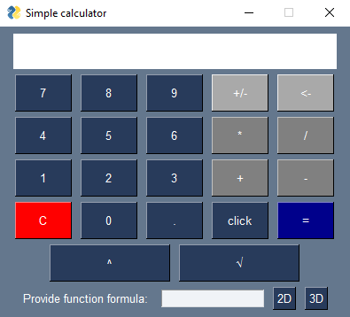
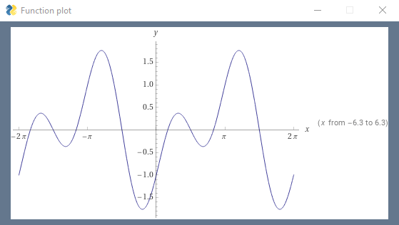
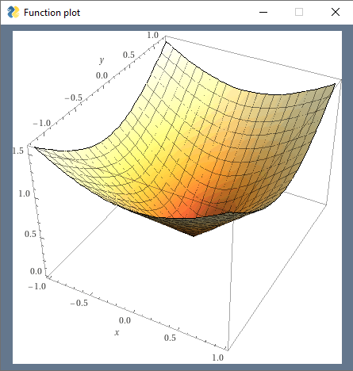

# Simple calculator with plots of functions
## Table of contents
* [General info](#general-info)
* [Setup](#setup)
* [Run project](#run-project)
* [Run tests](#run-tests)
* [Sample screenshots](#sample-screenshots)
* [Technologies](#technologies)
## General info
The goal of this project was to implement a working simple calculator with capability to display plot of any 2D or 3D function.

It's possible thanks to wolframalphaAPI

## Setup
In main folder install all dependecies using:
```bash
pip install -r requirements.txt
```
## Run project
Go to calculator directory and run:
```bash
python main.py
```
## Run tests
Go to tests directory and run:
```bash
python -m unittest unit_tests.py
```
## Screenshots
### Main application window

### Sample plots of functions:
 
## Technologies
Project is created with:
* Python 3.11.2
* PySimpleGUI 4.60.4
* requests 2.28.2
